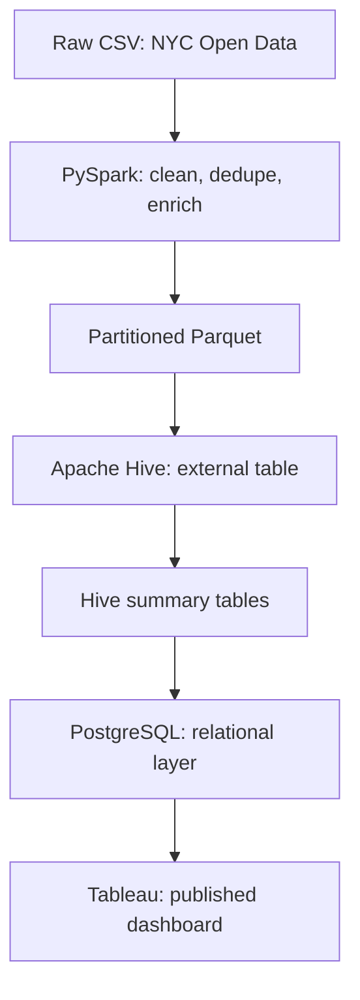
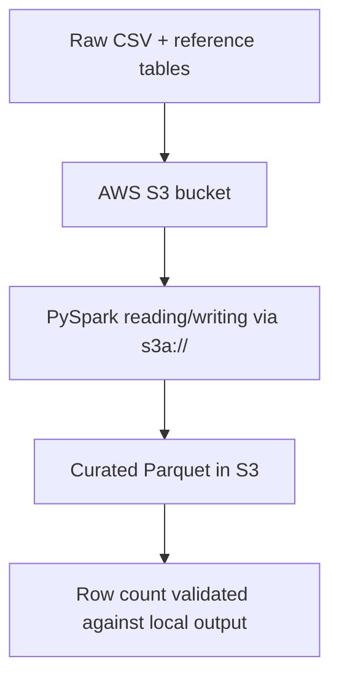

# Project Architecture: NYC 311 Service Request Data Pipeline

## 1. Project Overview

This project takes a full year of NYC 311 service request data (2023, roughly 3.2 million records) and turns it into something a business user can actually query and look at. The pipeline runs on PySpark for cleaning and transformation, Apache Hive for the warehouse layer, PostgreSQL for the relational reporting layer, and Tableau for the dashboard. A separate track mirrors the curated data to AWS S3 to demonstrate a small, real cloud migration. Jenkins runs the automated test suite on every change, pulling directly from the GitHub repository.

The build order followed the natural shape of a data pipeline: acquire, validate, transform, warehouse, store relationally, visualize, test, automate, and finally move part of it to the cloud. Each stage was validated against the row count from the previous stage before moving on. That number, 3,220,409, shows up again and again in this document because it was checked at every single handoff point.

## 2. Business Problem

A city agency, or anyone trying to understand how NYC 311 complaints behave over a year, needs answers to fairly simple operational questions: which complaint categories generate the most volume, how long does resolution actually take by category and borough, and how does that change month to month. The raw data from NYC Open Data answers none of these questions directly. It's a flat CSV with inconsistent casing, missing values, and no derived metrics like resolution time or complaint category groupings.

This project builds the layer that sits between that raw export and a usable answer: a repeatable pipeline that cleans the data once, stores it in a form that supports fast aggregation, and exposes it through a dashboard someone can click through without touching a single line of code.

## 3. Functional Requirements

- Ingest raw NYC 311 service request data for calendar year 2023
- Validate incoming records against expected schema and reject malformed rows with a documented reason
- Deduplicate on `unique_key` and standardize categorical fields (agency, borough, status)
- Derive resolution-time metrics (hours and days between creation and closure) and calendar breakdown columns
- Join reference dimension tables for agency name, complaint category, and borough ID
- Store the cleaned dataset as partitioned Parquet
- Expose the dataset through a Hive external table with correct partition registration
- Build summary tables at monthly and daily granularity using HiveQL aggregation and window functions
- Load curated summaries into PostgreSQL with appropriate constraints and at least one reporting view
- Publish an interactive, cross-filtering Tableau dashboard from the PostgreSQL data
- Automatically test the transformation logic, the load logic, and the final data quality of the curated output
- Run the test suite through a CI pipeline triggered from source control
- Mirror the curated dataset and reference tables to cloud object storage

## 4. Non-Functional Requirements

- **Reproducibility**: every stage can be rerun from source and produces the same row count and structure
- **Data integrity**: the row count is independently re-verified after every write, not assumed
- **Cost**: the entire project runs on free-tier or local resources; no component requires a paid AWS service to reproduce
- **Security**: no credentials are ever written to a file or committed to source control; all secrets are read from environment variables at runtime
- **Portability**: the pipeline runs on a single local Windows machine with no dependency on a managed cluster
- **Observability**: each script prints row counts, validation results, and stage completion so a failure is visible immediately rather than silent

## 5. System Architecture

The system has two parallel architectures: a local one that does the actual heavy processing, and a cloud-storage one that mirrors the curated output.

### Local architecture



### Cloud architecture



Compute stays local in both cases. Only storage moved to S3. This was a deliberate choice, covered in more detail under Design Decisions.

## 6. Data Flow

1. `src/acquisition/download_311_data.py` pulls the raw 2023 NYC 311 data and writes an acquisition manifest.
2. `src/reference/build_reference_tables.py` builds the three dimension tables: agency, complaint type with category, and borough.
3. `src/ingestion/validate_and_ingest.py` checks the raw data against expected schema, splits it into valid and rejected records, and writes an ingestion report.
4. `src/transformation/clean_311_data.py` reads the validated CSV, deduplicates, standardizes fields, derives resolution metrics, joins the three reference tables, and writes partitioned Parquet to `data/processed/cleaned_311_requests`.
5. `src/hive/create_hive_tables.py` registers that Parquet output as an external Hive table (`nyc311_analytics_db.service_requests`) and recovers its partitions.
6. `src/hive/build_summary_tables.py` builds two managed summary tables (`borough_category_monthly_summary` and `borough_category_daily_summary`) using `CREATE TABLE AS SELECT`, and runs a window-function query ranking each borough's top complaint category per month.
7. `src/postgres/load_to_postgres.py` reads both summary tables through Spark, converts to Pandas, and inserts into PostgreSQL, truncating and reloading on each run.
8. The two summary tables are exported to CSV and loaded into Tableau, which publishes a dashboard with three linked, cross-filtering charts.
9. `src/aws/upload_to_s3.py` uploads the reference tables and the curated Parquet dataset to the S3 bucket, then re-reads it from S3 and checks the row count against the local copy.

At every arrow in that list, a row count or record count is printed and checked. This wasn't added after the fact. It's how bugs got caught during development, twice, as described under Error Handling.

## 7. Component Architecture

| Component | Role | Technology |
|---|---|---|
| Acquisition | Downloads raw source data | Python, `requests` |
| Ingestion | Schema validation, reject/accept split | PySpark |
| Reference | Builds dimension tables | Python |
| Transformation | Cleaning, enrichment, derived columns | PySpark, refactored into pure functions |
| Warehouse | Partitioned external table, summary tables | Apache Hive (Spark's embedded metastore) |
| Relational store | Constrained tables, indexes, reporting view | PostgreSQL |
| Load | Moves data from Hive to PostgreSQL | PySpark, Pandas, psycopg2 |
| Visualization | Interactive dashboard | Tableau Public |
| Testing | Unit, regression, data quality tests | pytest |
| CI/CD | Runs the test suite on every change | Jenkins |
| Cloud storage | Mirrors curated data | AWS S3, `hadoop-aws` |
| Version control | Source of truth for all code | Git, GitHub |

## 8. Data Model

### Raw and curated schema

The curated dataset carries 53 data columns plus 2 partition columns (`created_year`, `created_month`), including the original 311 fields, three joined dimension keys and names (`agency_id`/`dim_agency_name`, `complaint_type_id`/`complaint_category`, `borough_id`), and five derived columns: `resolution_hours`, `resolution_days`, `created_hour`, `created_day_of_week`, and the two partition columns themselves.

### Dimension tables

- `dim_agency`: 14 rows (agency code, ID, full name)
- `dim_complaint_type`: 216 rows (complaint type, ID, category grouping)
- `dim_borough`: 6 rows (borough name, ID; includes `UNSPECIFIED` for records with no mapped borough)

### PostgreSQL relational schema

```sql
CREATE TABLE borough_category_monthly_summary (
    id                     SERIAL PRIMARY KEY,
    created_year           INT NOT NULL,
    created_month          INT NOT NULL CHECK (created_month BETWEEN 1 AND 12),
    borough                VARCHAR(20) NOT NULL,
    complaint_category     VARCHAR(50) NOT NULL,
    total_requests         INT NOT NULL CHECK (total_requests >= 0),
    avg_resolution_hours   NUMERIC(10,2),
    closed_requests        INT NOT NULL CHECK (closed_requests >= 0),
    unresolved_requests    INT NOT NULL CHECK (unresolved_requests >= 0),
    UNIQUE (created_year, created_month, borough, complaint_category)
);
```

A matching `borough_category_daily_summary` table exists at daily grain (26,291 rows) alongside the monthly one (972 rows). Both carry the same constraint pattern: non-negative counts, a valid month range, and a uniqueness constraint that stops the load script from silently duplicating rows on a rerun. A view, `category_totals_ytd`, aggregates the monthly table into one row per complaint category for year-to-date reporting.

## 9. Spark Processing Architecture

Cleaning logic originally lived as inline, top-level code in a single script, which made it untestable since importing the file would trigger a full run against real data. It was refactored into five pure functions in `src/transformation/transform_functions.py`: `deduplicate`, `standardize_categorical_fields`, `handle_missing_values`, `add_derived_features`, and `join_reference_dimensions`. Each takes a DataFrame and returns a DataFrame, with no file I/O or printing inside them. `clean_311_data.py` became a thin orchestration script that calls these in order and handles the actual reads, writes, and logging.

Spark runs in local mode (`local[4]`) with driver memory set to 4GB and shuffle partitions reduced to 16, tuned for a single machine rather than a cluster. The write step partitions output by `created_year` and `created_month`, which is what allows Hive to later register the same partition structure without reshuffling the data.

## 10. Hive Architecture

Hive runs through Spark's built-in Hive support (`enableHiveSupport()`) with an embedded Derby metastore rather than a standalone Hive server. This is a legitimate, commonly used setup for smaller environments. It gives a real Hive metastore and HiveQL support without the overhead of running a separate multi-node Hive install, which would be excessive for a project this size.

The database `nyc311_analytics_db` holds one external table (`service_requests`, pointing at the Parquet output with all 12 monthly partitions registered) and two managed summary tables built with `CREATE TABLE AS SELECT`. The distinction matters: the external table doesn't own its underlying files, so Spark or any other tool can read the same Parquet independently, while the summary tables are Hive-owned since nothing else needs direct access to them.

## 11. Database Architecture

PostgreSQL holds the curated, summary-level output only, not the full 3.2 million raw rows. This is a deliberate layering choice: Spark and Hive handle volume, PostgreSQL serves the smaller, query-ready reporting layer that a BI tool actually needs. The two summary tables (monthly and daily) give two levels of granularity. Indexes exist on the columns most likely to be filtered (`created_year`/`created_month`, `borough`, `request_date`), and the `category_totals_ytd` view answers a specific business question (year-to-date totals by category) without requiring the consumer to write their own aggregation.

## 12. Cloud Architecture

The cloud component uses AWS S3 as an object store, accessed by Spark through the `s3a://` filesystem connector (`hadoop-aws` and `aws-java-sdk-bundle`, both matched to the exact Hadoop version bundled with PySpark, 3.3.4). Access is through a single IAM user (`nyc311-pipeline-user`) scoped by policy to list, read, and write objects in exactly one bucket (`nyc311-pipeline-sohail-2026`), with no access to any other AWS service or resource. Credentials are read from environment variables at runtime and never written to disk.

Compute was intentionally left local. EMR or another managed Spark cluster would demonstrate a deeper cloud migration, but it bills by the hour and is easy to leave running by accident, which isn't a reasonable tradeoff for a project at this scale on a free-tier account. The migration here proves the pattern (Spark speaking to cloud storage over the same APIs it would use against a cluster's storage layer) without taking on that cost or operational risk.

## 13. CI/CD Architecture

Jenkins runs as a standalone process (the generic `.war` package under a separately installed JDK 21, since the current Jenkins LTS requires Java 21 while Spark in this project runs on Java 17) rather than as a Windows service, since getting a Microsoft account approved for Windows service logon turned into a dead end and running it from a terminal was the faster, equally valid path for a local CI demo.

The pipeline is defined in a single `Jenkinsfile` with three stages: an environment check (confirms the venv's Python, pytest, and Java are all reachable), unit tests (the 11 transformation and load-helper tests), and data quality tests (the 8 tests that run against the real curated output). Each stage writes a JUnit XML report, which Jenkins parses and displays as pass/fail counts. The pipeline definition is pulled directly from GitHub (`Pipeline script from SCM`) rather than pasted into the job configuration, so the version of the pipeline that runs is always the one in source control.

## 14. Security Considerations

- No credential of any kind (Postgres password, AWS keys) is ever written to a file. All are read from environment variables set per terminal session.
- The AWS root account has multi-factor authentication enabled and no access keys. All programmatic access goes through the scoped IAM user described in section 12.
- The S3 bucket blocks all public access.
- `.gitignore` explicitly excludes config files, `.env` files, `.pem`/`.key` files, and the entire `data/` directory, and the repository was manually scanned for stray credential files before the first push.
- The PostgreSQL and Hive setups run entirely on localhost with no external network exposure.

## 15. Error Handling

Each pipeline stage prints its row counts and validation results directly to the console rather than failing silently. The ingestion stage writes a JSON report documenting exactly why each rejected record failed validation. Two real failures came up during development and are worth recording here rather than glossing over, since they shaped how the pipeline validates itself:

**Hive partition discovery returning zero rows.** After creating the external table, `MSCK REPAIR TABLE` completed without error but registered no partitions, and a row count against the table came back as 0. The fix was `ALTER TABLE ... RECOVER PARTITIONS`, Spark's own partition-discovery command, combined with switching the table's `LOCATION` from a relative path to an absolute `file:///` URI. The original relative path had been silently baked into the metastore on the first, broken attempt, so the table also had to be dropped and recreated rather than just repaired.

**A NaN silently corrupting a PostgreSQL aggregate.** Two rows in the monthly summary table (both under the `UNSPECIFIED` borough) had every request still open, so `AVG(resolution_hours)` in Hive correctly returned `NULL` for those groups. But converting that Hive `NULL` through a Pandas DataFrame turned it into a `NaN`, and the load script's `psycopg2` insert wrote that `NaN` in as the literal string `"NaN"` rather than a SQL `NULL`. Since a SQL `NULL` is correctly ignored by `AVG()` but a string `"NaN"` poisons the column entirely, one query in the Tableau-facing view (`category_totals_ytd`) was returning `NaN` for two whole categories instead of a real average. The fix converts any NaN-valued float to `None` before the insert, and a regression test now locks that behavior in.

Both bugs were caught because the row counts and, in the second case, the actual values were checked after every stage rather than assumed to be correct because the script exited without an error.

## 16. Deployment Architecture

There is no deployment target in the traditional sense. Everything runs on a single local Windows machine: Spark in local mode, Hive through Spark's embedded metastore, PostgreSQL as a locally installed service, and Jenkins as a manually started process. The only deployed artifact outside that machine is the published Tableau Public dashboard and the mirrored data in S3. The GitHub repository is the source of truth that Jenkins pulls from, so "deployment" here means running the pipeline scripts in order against that source, not pushing to a server.

## 17. Design Decisions

- **Spark's embedded Hive metastore instead of a standalone Hive server.** A full Hive install on Windows is disproportionately painful for what this project needs, and the embedded metastore gives real HiveQL support without it.
- **PostgreSQL holds summaries only, not raw data.** Keeps the relational layer fast and small, and reflects how these two technologies are actually used together in practice: Spark/Hive for volume, PostgreSQL for reporting.
- **Two levels of summary granularity (monthly and daily).** One table alone would have been enough to prove the pattern, but having both demonstrates the tradeoff between aggregation level and row count explicitly.
- **Tableau Public instead of Tableau Desktop.** Desktop was already installed but under a license that couldn't be authenticated in this environment, and Tableau Public is genuinely free with no time limit, at the cost of every published workbook being publicly visible, which is a reasonable tradeoff for open NYC 311 data.
- **CSV export from PostgreSQL into Tableau instead of a live connection.** Tableau Public cannot connect live to a local database server, since a viewer's browser has no way to reach it. A one-time CSV export is the standard, correct workaround, and it matches how a static published dashboard is supposed to work anyway.
- **Local Spark compute against S3 storage instead of EMR.** Covered in section 12. Storage moved to the cloud; compute stayed local, on cost and operational grounds.
- **Jenkins run from a terminal instead of as a Windows service.** The available Windows account couldn't pass the service logon credential check (a Microsoft account without a service-compatible password), and running Jenkins from a terminal is a fully valid way to demonstrate a working CI pipeline locally.
- **`pytest.ini` with a shared `pythonpath` instead of per-file `sys.path` hacks.** Keeps the import setup in one place and matches what Jenkins needs to run the same suite unmodified.

## 18. Known Limitations

- The pipeline processes one calendar year (2023) of data. Multi-year support would need the acquisition and validation scripts extended, though the transformation logic already derives `created_year` generically.
- PostgreSQL holds summary data only. A drill-down from the dashboard into an individual complaint record isn't possible from the relational layer, since that detail lives only in Hive/Parquet. This is a deliberate scope decision, not an oversight, but it's worth stating plainly.
- Cloud compute (EMR or an equivalent managed Spark service) was not implemented. The current cloud piece proves storage connectivity, not a full compute migration.
- Jenkins runs manually rather than as an always-on service, so CI here is triggered on demand rather than automatically on every push (no webhook is configured from GitHub back to this local Jenkins instance, since that would require exposing it to the internet).
- The AWS environment used for this project is time-limited by design (a free-tier account with a credit balance and a six-month window), so the cloud artifacts described here are not intended to persist indefinitely.
